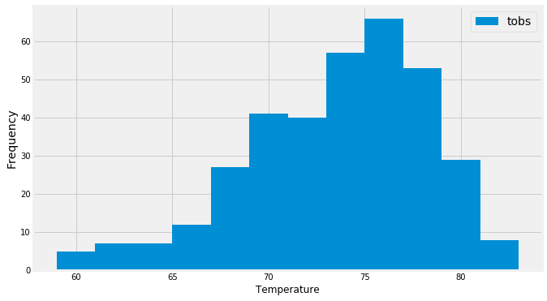

```python
# importing the dependencies
#%matplotlib notebook
from matplotlib import style
style.use('fivethirtyeight')
import matplotlib.pyplot as plt
```


```python
import numpy as np
import pandas as pd
```


```python
import datetime as dt
```

# Reflect Tables into SQLAlchemy ORM


```python
# Python SQL toolkit and Object Relational Mapper
import sqlalchemy
from sqlalchemy.ext.automap import automap_base
from sqlalchemy.orm import Session
from sqlalchemy import create_engine, func
```


```python
engine = create_engine("sqlite:///Resources/hawaii.sqlite")
```


```python
# reflect an existing database into a new model
Base = automap_base()
# reflect the tables
Base.prepare(engine, reflect=True)
```


```python
# We can view all of the classes that automap found
Base.classes.keys()
```


    ['measurement', 'station']


```python
# Save references to each table
Measurement = Base.classes.measurement
Station = Base.classes.station
```


```python
# Create our session (link) from Python to the DB
session = Session(engine)
```

## Precipitation Analysis

### Using Pandas


```python
# Using Pandas 
weather_data = pd.read_sql("SELECT * FROM measurement", engine)
weather_data.head()
```


<div>
<style scoped>
    .dataframe tbody tr th:only-of-type {
        vertical-align: middle;
    }

    .dataframe tbody tr th {
        vertical-align: top;
    }

    .dataframe thead th {
        text-align: right;
    }
</style>
<table border="1" class="dataframe">
  <thead>
    <tr style="text-align: right;">
      <th></th>
      <th>id</th>
      <th>station</th>
      <th>date</th>
      <th>prcp</th>
      <th>tobs</th>
    </tr>
  </thead>
  <tbody>
    <tr>
      <th>0</th>
      <td>1</td>
      <td>USC00519397</td>
      <td>2010-01-01</td>
      <td>0.08</td>
      <td>65.0</td>
    </tr>
    <tr>
      <th>1</th>
      <td>2</td>
      <td>USC00519397</td>
      <td>2010-01-02</td>
      <td>0.00</td>
      <td>63.0</td>
    </tr>
    <tr>
      <th>2</th>
      <td>3</td>
      <td>USC00519397</td>
      <td>2010-01-03</td>
      <td>0.00</td>
      <td>74.0</td>
    </tr>
    <tr>
      <th>3</th>
      <td>4</td>
      <td>USC00519397</td>
      <td>2010-01-04</td>
      <td>0.00</td>
      <td>76.0</td>
    </tr>
    <tr>
      <th>4</th>
      <td>5</td>
      <td>USC00519397</td>
      <td>2010-01-06</td>
      <td>NaN</td>
      <td>73.0</td>
    </tr>
  </tbody>
</table>
</div>


```python
# Latest Date
latest_date = session.query(Measurement.date).order_by(Measurement.date.desc()).first().date
latest_date
```


    '2017-08-23'


```python
end_date = latest_date
```


```python
end_date
```


    '2017-08-23'


```python
start_date = dt.datetime.strptime(end_date, '%Y-%m-%d') - dt.timedelta(days=365)
```


```python
start_date
```


    datetime.datetime(2016, 8, 23, 0, 0)


```python
start_date = start_date.strftime('%y-%m-%d')
```


```python
start_date
```


    '16-08-23'


```python
start_date = "2016-08-23"
end_date = "2017-08-23"

weather_data_one_year = weather_data[weather_data["date"].between(start_date, end_date)]
weather_data_one_year.head()
```


<div>
<style scoped>
    .dataframe tbody tr th:only-of-type {
        vertical-align: middle;
    }

    .dataframe tbody tr th {
        vertical-align: top;
    }

    .dataframe thead th {
        text-align: right;
    }
</style>
<table border="1" class="dataframe">
  <thead>
    <tr style="text-align: right;">
      <th></th>
      <th>id</th>
      <th>station</th>
      <th>date</th>
      <th>prcp</th>
      <th>tobs</th>
    </tr>
  </thead>
  <tbody>
    <tr>
      <th>2363</th>
      <td>2364</td>
      <td>USC00519397</td>
      <td>2016-08-23</td>
      <td>0.00</td>
      <td>81.0</td>
    </tr>
    <tr>
      <th>2364</th>
      <td>2365</td>
      <td>USC00519397</td>
      <td>2016-08-24</td>
      <td>0.08</td>
      <td>79.0</td>
    </tr>
    <tr>
      <th>2365</th>
      <td>2366</td>
      <td>USC00519397</td>
      <td>2016-08-25</td>
      <td>0.08</td>
      <td>80.0</td>
    </tr>
    <tr>
      <th>2366</th>
      <td>2367</td>
      <td>USC00519397</td>
      <td>2016-08-26</td>
      <td>0.00</td>
      <td>79.0</td>
    </tr>
    <tr>
      <th>2367</th>
      <td>2368</td>
      <td>USC00519397</td>
      <td>2016-08-27</td>
      <td>0.00</td>
      <td>77.0</td>
    </tr>
  </tbody>
</table>
</div>


```python
len(weather_data_one_year)
```


    2230


```python
precipitation_data = weather_data_one_year[["prcp", "date"]]
precipitation_data.set_index('date', inplace=True)
# Sort the dataframe by date
precipitation_data_sorted = precipitation_data.sort_values('date', ascending=True )
precipitation_data_sorted.head()

```


<div>
<style scoped>
    .dataframe tbody tr th:only-of-type {
        vertical-align: middle;
    }

    .dataframe tbody tr th {
        vertical-align: top;
    }

    .dataframe thead th {
        text-align: right;
    }
</style>
<table border="1" class="dataframe">
  <thead>
    <tr style="text-align: right;">
      <th></th>
      <th>prcp</th>
    </tr>
    <tr>
      <th>date</th>
      <th></th>
    </tr>
  </thead>
  <tbody>
    <tr>
      <th>2016-08-23</th>
      <td>0.00</td>
    </tr>
    <tr>
      <th>2016-08-23</th>
      <td>NaN</td>
    </tr>
    <tr>
      <th>2016-08-23</th>
      <td>1.79</td>
    </tr>
    <tr>
      <th>2016-08-23</th>
      <td>0.05</td>
    </tr>
    <tr>
      <th>2016-08-23</th>
      <td>0.15</td>
    </tr>
  </tbody>
</table>
</div>


```python
# Use Pandas Plotting with Matplotlib to plot the data
# Rotate the xticks for the dates
precipitation_chart = precipitation_data_sorted.plot(kind = "line",grid=True, figsize=(10,6), rot=30, x_compat=True, fontsize=12, title = "Precipitation data for one year")
precipitation_chart.set_xlabel("Date")
precipitation_chart.set_ylabel("Precipitation")
plt.show()
```


### Using Session Query


```python
## Using Session Query
# Latest Date
latest_date = session.query(Measurement.date).order_by(Measurement.date.desc()).first().date
latest_date
```


    '2017-08-23'


```python
# Date 12 months from the latest date
last_twelve_months = dt.datetime.strptime(latest_date, '%Y-%m-%d') - dt.timedelta(days=365)
last_twelve_months
```


    datetime.datetime(2016, 8, 23, 0, 0)


```python
# Retrieve the last 12 months of precipitation data
p_results = session.query(Measurement.date, Measurement.prcp).\
                    filter(Measurement.date >= last_twelve_months).\
                    order_by(Measurement.date).all()
```


```python
# Put data into dataframe
precipitation_df = pd.DataFrame(p_results, columns=['Date', 'Precipitation'])
precipitation_df.set_index('Date', inplace=True)
precipitation_df.head()
```


<div>
<style scoped>
    .dataframe tbody tr th:only-of-type {
        vertical-align: middle;
    }

    .dataframe tbody tr th {
        vertical-align: top;
    }

    .dataframe thead th {
        text-align: right;
    }
</style>
<table border="1" class="dataframe">
  <thead>
    <tr style="text-align: right;">
      <th></th>
      <th>Precipitation</th>
    </tr>
    <tr>
      <th>Date</th>
      <th></th>
    </tr>
  </thead>
  <tbody>
    <tr>
      <th>2016-08-24</th>
      <td>0.08</td>
    </tr>
    <tr>
      <th>2016-08-24</th>
      <td>2.15</td>
    </tr>
    <tr>
      <th>2016-08-24</th>
      <td>2.28</td>
    </tr>
    <tr>
      <th>2016-08-24</th>
      <td>NaN</td>
    </tr>
    <tr>
      <th>2016-08-24</th>
      <td>1.22</td>
    </tr>
  </tbody>
</table>
</div>


```python
# Use Pandas Plotting with Matplotlib to plot the data
# Rotate the xticks for the dates
precipitation_chart_new = precipitation_df.plot(kind = "line",grid=True, figsize=(10,6), rot=30, x_compat=True, fontsize=12, title = "Precipitation data for one year")
precipitation_chart_new.set_xlabel("Date")
precipitation_chart_new.set_ylabel("Precipitation")
plt.show()
```


- Use Pandas to calculate the summary statistics for the precipitation data


```python
# Using Pandas
precipitation_data_sorted.describe()
```


<div>
<style scoped>
    .dataframe tbody tr th:only-of-type {
        vertical-align: middle;
    }

    .dataframe tbody tr th {
        vertical-align: top;
    }

    .dataframe thead th {
        text-align: right;
    }
</style>
<table border="1" class="dataframe">
  <thead>
    <tr style="text-align: right;">
      <th></th>
      <th>prcp</th>
    </tr>
  </thead>
  <tbody>
    <tr>
      <th>count</th>
      <td>2021.000000</td>
    </tr>
    <tr>
      <th>mean</th>
      <td>0.177279</td>
    </tr>
    <tr>
      <th>std</th>
      <td>0.461190</td>
    </tr>
    <tr>
      <th>min</th>
      <td>0.000000</td>
    </tr>
    <tr>
      <th>25%</th>
      <td>0.000000</td>
    </tr>
    <tr>
      <th>50%</th>
      <td>0.020000</td>
    </tr>
    <tr>
      <th>75%</th>
      <td>0.130000</td>
    </tr>
    <tr>
      <th>max</th>
      <td>6.700000</td>
    </tr>
  </tbody>
</table>
</div>


```python
## Using Session Query data
# Print the summary statistics for the precipitation data
precipitation_df.describe()
```


<div>
<style scoped>
    .dataframe tbody tr th:only-of-type {
        vertical-align: middle;
    }

    .dataframe tbody tr th {
        vertical-align: top;
    }

    .dataframe thead th {
        text-align: right;
    }
</style>
<table border="1" class="dataframe">
  <thead>
    <tr style="text-align: right;">
      <th></th>
      <th>Precipitation</th>
    </tr>
  </thead>
  <tbody>
    <tr>
      <th>count</th>
      <td>2015.000000</td>
    </tr>
    <tr>
      <th>mean</th>
      <td>0.176462</td>
    </tr>
    <tr>
      <th>std</th>
      <td>0.460288</td>
    </tr>
    <tr>
      <th>min</th>
      <td>0.000000</td>
    </tr>
    <tr>
      <th>25%</th>
      <td>0.000000</td>
    </tr>
    <tr>
      <th>50%</th>
      <td>0.020000</td>
    </tr>
    <tr>
      <th>75%</th>
      <td>0.130000</td>
    </tr>
    <tr>
      <th>max</th>
      <td>6.700000</td>
    </tr>
  </tbody>
</table>
</div>


## Station Analysis

### Using Pandas


```python
station_data = pd.read_sql("SELECT * FROM station", engine)
station_data
```


<div>
<style scoped>
    .dataframe tbody tr th:only-of-type {
        vertical-align: middle;
    }

    .dataframe tbody tr th {
        vertical-align: top;
    }

    .dataframe thead th {
        text-align: right;
    }
</style>
<table border="1" class="dataframe">
  <thead>
    <tr style="text-align: right;">
      <th></th>
      <th>id</th>
      <th>station</th>
      <th>name</th>
      <th>latitude</th>
      <th>longitude</th>
      <th>elevation</th>
    </tr>
  </thead>
  <tbody>
    <tr>
      <th>0</th>
      <td>1</td>
      <td>USC00519397</td>
      <td>WAIKIKI 717.2, HI US</td>
      <td>21.27160</td>
      <td>-157.81680</td>
      <td>3.0</td>
    </tr>
    <tr>
      <th>1</th>
      <td>2</td>
      <td>USC00513117</td>
      <td>KANEOHE 838.1, HI US</td>
      <td>21.42340</td>
      <td>-157.80150</td>
      <td>14.6</td>
    </tr>
    <tr>
      <th>2</th>
      <td>3</td>
      <td>USC00514830</td>
      <td>KUALOA RANCH HEADQUARTERS 886.9, HI US</td>
      <td>21.52130</td>
      <td>-157.83740</td>
      <td>7.0</td>
    </tr>
    <tr>
      <th>3</th>
      <td>4</td>
      <td>USC00517948</td>
      <td>PEARL CITY, HI US</td>
      <td>21.39340</td>
      <td>-157.97510</td>
      <td>11.9</td>
    </tr>
    <tr>
      <th>4</th>
      <td>5</td>
      <td>USC00518838</td>
      <td>UPPER WAHIAWA 874.3, HI US</td>
      <td>21.49920</td>
      <td>-158.01110</td>
      <td>306.6</td>
    </tr>
    <tr>
      <th>5</th>
      <td>6</td>
      <td>USC00519523</td>
      <td>WAIMANALO EXPERIMENTAL FARM, HI US</td>
      <td>21.33556</td>
      <td>-157.71139</td>
      <td>19.5</td>
    </tr>
    <tr>
      <th>6</th>
      <td>7</td>
      <td>USC00519281</td>
      <td>WAIHEE 837.5, HI US</td>
      <td>21.45167</td>
      <td>-157.84889</td>
      <td>32.9</td>
    </tr>
    <tr>
      <th>7</th>
      <td>8</td>
      <td>USC00511918</td>
      <td>HONOLULU OBSERVATORY 702.2, HI US</td>
      <td>21.31520</td>
      <td>-157.99920</td>
      <td>0.9</td>
    </tr>
    <tr>
      <th>8</th>
      <td>9</td>
      <td>USC00516128</td>
      <td>MANOA LYON ARBO 785.2, HI US</td>
      <td>21.33310</td>
      <td>-157.80250</td>
      <td>152.4</td>
    </tr>
  </tbody>
</table>
</div>


```python
# How many stations are available in this dataset?
station_data["station"].count()
```


    9


```python
# What are the most active stations?
# List the stations and the counts in descending order.
weather_data["station"].value_counts()
```


    USC00519281    2772
    USC00519397    2724
    USC00513117    2709
    USC00519523    2669
    USC00516128    2612
    USC00514830    2202
    USC00511918    1979
    USC00517948    1372
    USC00518838     511
    Name: station, dtype: int64


```python
weather_data_station_counts = weather_data["station"].value_counts()
```


```python
# The station with maximum number of temperature observations
active_station = weather_data_station_counts.index[0]
active_station
```


    'USC00519281'


```python
# Using the station id from the previous query, calculate the lowest temperature recorded, 
# highest temperature recorded, and average temperature most active station?
weather_data_active_station = weather_data.loc[(weather_data["station"] == active_station), :]
Lowest_temperature = weather_data_active_station["tobs"].min()
Highest_temperature = weather_data_active_station["tobs"].max()
Average_temperature =  weather_data_active_station["tobs"].mean()
print(f"For the most active station The lowest temperature, The Highest temperature, The Average temperature is {Lowest_temperature} , {Highest_temperature}, {Average_temperature}")
```

    For the most active station The lowest temperature, The Highest temperature, The Average temperature is 54.0 , 85.0, 71.66378066378067
    


```python
# Choose the station with the highest number of temperature observations.
# Query the last 12 months of temperature observation data for this station and plot the results as a histogram
start_date = "2016-08-23"
end_date = "2017-08-23"

weather_data_one_year = weather_data[weather_data["date"].between(start_date, end_date)]
weather_data_active_station_one_year = weather_data_one_year.loc[(weather_data_one_year["station"] == active_station), :]
```


```python
temperature_data = weather_data_active_station_one_year[["tobs", "date"]]
x_data = temperature_data["tobs"]
```


```python
plt.hist(x_data, 12, label = "tobs") 
plt.xlabel('Temperature')
plt.ylabel('Frequency')
plt.legend(loc=1, prop={'size': 14})
plt.show()
```


### Using Session Query


```python
# How many stations are available in this dataset?
station_count = session.query(Station).count()
print(f"The number of weather stations on Honolulu Hawaii are {station_count}.")
```

    The number of weather stations on Honolulu Hawaii are 9.
    


```python
# What are the most active stations?
# List the stations and the counts in descending order.
station_observation_count = session.query(Measurement.station, func.count(Measurement.station)).group_by(Measurement.station).order_by(func.count(Measurement.station).desc()).all()
station_observation_count
```


    [('USC00519281', 2772),
     ('USC00519397', 2724),
     ('USC00513117', 2709),
     ('USC00519523', 2669),
     ('USC00516128', 2612),
     ('USC00514830', 2202),
     ('USC00511918', 1979),
     ('USC00517948', 1372),
     ('USC00518838', 511)]


```python
# The station with maximum number of temperature observations
station_observation_count[0][0]
```


    'USC00519281'


```python
print(f"The weather station with the highest amount of observations is {station_observation_count[0][0]} with {station_observation_count[0][1]} observations.")
```

    The weather station with the highest amount of observations is USC00519281 with 2772 observations.
    


```python
# Using the station id from the previous query, calculate the lowest temperature recorded, 
# highest temperature recorded, and average temperature most active station?
active_station = station_observation_count[0][0]
session.query(func.min(Measurement.tobs), func.max(Measurement.tobs), func.avg(Measurement.tobs)).\
                filter(Measurement.station == active_station).all()
```


    [(54.0, 85.0, 71.66378066378067)]


```python
# Choose the station with the highest number of temperature observations.
# Query the last 12 months of temperature observation data for this station and plot the results as a histogram

results = session.query(Measurement.tobs, Measurement.date).\
filter(Measurement.date >= '2016-08-23', Measurement.date <= '2017-08-23', Measurement.station == active_station).all()

df = pd.DataFrame(results)

# Plot the results as a histogram with bins=12.
df.plot.hist(bins=12, grid=True, figsize=(10,6))
plt.ylabel('Frequency', size=14)
plt.xlabel('Temperature')
plt.legend(loc=1, prop={'size': 14})
plt.show()
```





## Temperature Analysis (Optional)


```python
# Write a function called `calc_temps` that will accept start date and end date in the format '%Y-%m-%d' 
# and return the minimum, average, and maximum temperatures for that range of dates
def calc_temps(start_date, end_date):
    """TMIN, TAVG, and TMAX for a list of dates.
    
    Args:
        start_date (string): A date string in the format %Y-%m-%d
        end_date (string): A date string in the format %Y-%m-%d
        
    Returns:
        TMIN, TAVE, and TMAX
    """
    
    return session.query(func.min(Measurement.tobs), func.avg(Measurement.tobs), func.max(Measurement.tobs)).\
        filter(Measurement.date >= start_date).filter(Measurement.date <= end_date).all()
print(calc_temps('2012-02-28', '2012-03-05'))
```

    [(62.0, 69.57142857142857, 74.0)]
    


```python
# Use your previous function `calc_temps` to calculate the tmin, tavg, and tmax 
# for your trip using the previous year's data for those same dates.
def calc_temps(start_date, end_date):
    """TMIN, TAVG, and TMAX for a list of dates.
    
    Args:
        start_date (string): A date string in the format %Y-%m-%d
        end_date (string): A date string in the format %Y-%m-%d
        
    Returns:
        TMIN, TAVE, and TMAX
    """
    
    return session.query(func.min(Measurement.tobs), func.avg(Measurement.tobs), func.max(Measurement.tobs)).\
        filter(Measurement.date >= start_date).filter(Measurement.date <= end_date).all()
print(calc_temps('2017-02-28', '2017-03-05'))
```

    [(64.0, 72.02777777777777, 78.0)]
    


```python
trip_results = calc_temps('2017-02-28', '2017-03-05')
trip_results
```


    [(64.0, 72.02777777777777, 78.0)]


```python
# Plot the results from your previous query as a bar chart. 
# Use "Trip Avg Temp" as your Title
# Use the average temperature for the y value
# Use the peak-to-peak (tmax-tmin) value as the y error bar (yerr)
trip_df = pd.DataFrame(trip_results, columns=['Min Temp', 'Avg Temp', 'Max Temp'])
avg_temp = trip_df['Avg Temp']
min_max_temp = trip_df.iloc[0]['Max Temp'] - trip_df.iloc[0]['Min Temp']
temp_chart = avg_temp.plot(kind='bar', yerr=min_max_temp, grid = True, figsize=(6,8), alpha=0.5, color='coral')
temp_chart.set_title("Trip Avg Temp", fontsize=20)
temp_chart.set_ylabel("Temp (F)")
plt.xticks([])
plt.show()
```


### Using pandas


```python
# Calculate the rainfall per weather station for your trip dates using the previous year's matching dates.
trip_start_date = "2017-02-28"
trip_end_date = "2017-03-5"

weather_data_one_year_trip = weather_data_one_year[weather_data_one_year["date"].between(trip_start_date, trip_end_date)]
weather_data_one_year_trip_per_station = weather_data_one_year_trip.groupby("station")
weather_data_one_year_trip_per_station["prcp"].sum()
```


    station
    USC00513117    6.95
    USC00514830    2.06
    USC00516128    5.51
    USC00517948    3.04
    USC00519281    6.85
    USC00519397    2.76
    USC00519523    3.27
    Name: prcp, dtype: float64


### using session query


```python
## using session query
# Calculate the rainfall per weather station for your trip dates using the previous year's matching dates.
trip_start_date = "2017-02-28"
trip_end_date = "2017-03-5"
rainfall_trip = session.query(Measurement.station, func.sum(Measurement.prcp)).filter(Measurement.date >= trip_start_date , Measurement.date <= trip_end_date).group_by(Measurement.station).\
order_by(func.sum(Measurement.prcp).desc()).all()

print("Total Rainfall Last Year")
for station, rainfall in rainfall_trip:
    print(f"Station: {station}, Total Rainfall: {rainfall}.")
```

    Total Rainfall Last Year
    Station: USC00513117, Total Rainfall: 6.95.
    Station: USC00519281, Total Rainfall: 6.85.
    Station: USC00516128, Total Rainfall: 5.51.
    Station: USC00519523, Total Rainfall: 3.27.
    Station: USC00517948, Total Rainfall: 3.04.
    Station: USC00519397, Total Rainfall: 2.76.
    Station: USC00514830, Total Rainfall: 2.0599999999999996.
    


```python
# Calculate the rainfall per weather station for your trip dates using the previous year's matching dates.
# Sort this in descending order by precipitation amount and list the station, name, latitude, longitude, and elevation

sel = [Station.station,Station.name,Station.latitude,Station.longitude,Station.elevation,func.sum(Measurement.prcp)]
results = session.query(*sel).filter(Measurement.station == Station.station).filter(Measurement.date >='2017-01-01').\
filter(Measurement.date <= '2017-01-07').group_by(Station.station).order_by(func.sum(Measurement.prcp).desc()).all()
results
```


    [('USC00519523',
      'WAIMANALO EXPERIMENTAL FARM, HI US',
      21.33556,
      -157.71139,
      19.5,
      0.61),
     ('USC00514830',
      'KUALOA RANCH HEADQUARTERS 886.9, HI US',
      21.5213,
      -157.8374,
      7.0,
      0.6),
     ('USC00516128',
      'MANOA LYON ARBO 785.2, HI US',
      21.3331,
      -157.8025,
      152.4,
      0.6),
     ('USC00513117', 'KANEOHE 838.1, HI US', 21.4234, -157.8015, 14.6, 0.35),
     ('USC00519281',
      'WAIHEE 837.5, HI US',
      21.45167,
      -157.84888999999998,
      32.9,
      0.2),
     ('USC00519397', 'WAIKIKI 717.2, HI US', 21.2716, -157.8168, 3.0, 0.0)]


```python
# Create a query that will calculate the daily normals 
# (i.e. the averages for tmin, tmax, and tavg for all historic data matching a specific month and day)

def daily_normals(date):
    """Daily Normals.
    
    Args:
        date (str): A date string in the format '%m-%d'
        
    Returns:
        A list of tuples containing the daily normals, tmin, tavg, and tmax
    
    """
    
    sel = [func.min(Measurement.tobs), func.avg(Measurement.tobs), func.max(Measurement.tobs)]
    return session.query(*sel).filter(func.strftime("%m-%d", Measurement.date) == date).all()
    
daily_normals("01-01")
```


    [(62.0, 69.15384615384616, 77.0)]


```python
# calculate the daily normals for your trip
def daily_normals(date):
    """Daily Normals.
    
    Args:
        date (str): A date string in the format '%m-%d'
        
    Returns:
        A list of tuples containing the daily normals, tmin, tavg, and tmax
    
    """
    
    sel = [func.min(Measurement.tobs), func.avg(Measurement.tobs), func.max(Measurement.tobs)]
    return session.query(*sel).filter(func.strftime("%m-%d", Measurement.date) == date).all()
    
daily_normals("02-28")

# push each tuple of calculations into a list called `normals`


# Set the start and end date of the trip
trip_start_date = "2017-02-28"
trip_end_date = "2017-03-5"

# Use the start and end date to create a range of dates
date_range = pd.date_range(start='2017-02-28', end='2017-03-5')

# Stip off the year and save a list of %m-%d strings

MonthDate = date_range.map(lambda x:x.strftime('%m-%d'))


# Loop through the list of %m-%d strings and calculate the normals for each date
trips_normals_list = []
for elements in MonthDate:
    trips_normals = daily_normals(elements)
    trips_normals_list.append(trips_normals)
print(trips_normals_list)

```

    [[(65.0, 70.65517241379311, 80.0)], [(64.0, 70.0327868852459, 76.0)], [(61.0, 70.36666666666666, 78.0)], [(60.0, 70.06896551724138, 78.0)], [(57.0, 69.27272727272727, 77.0)], [(60.0, 67.89090909090909, 76.0)]]
    


```python
# Loop through the list of %m-%d strings and calculate the normals for each date
trips_normals_Min_temp = []
Min_Temp, Avg_Temp, Max_Temp = [], [], []
for elements in MonthDate:
    trips_normals = daily_normals(elements)
    for x, y, z in trips_normals:
        xs = x
        ys = y
        zs = z
    Min_Temp.append(xs)
    Avg_Temp.append(ys)
    Max_Temp.append(zs)
```


```python
Trip_dates = ['2018-02-28', '2018-03-01', '2018-03-02', '2018-03-03',
               '2018-03-04', '2018-03-05']
```


```python
# Load the previous query results into a Pandas DataFrame and add the `trip_dates` range as the `date` index
trips_normals_list_df = pd.DataFrame({'Min_Temp' : Min_Temp, 'Avg_Temp' : Avg_Temp, 'Max_Temp':Max_Temp}, index = Trip_dates)
trips_normals_list_df
```


<div>
<style scoped>
    .dataframe tbody tr th:only-of-type {
        vertical-align: middle;
    }

    .dataframe tbody tr th {
        vertical-align: top;
    }

    .dataframe thead th {
        text-align: right;
    }
</style>
<table border="1" class="dataframe">
  <thead>
    <tr style="text-align: right;">
      <th></th>
      <th>Min_Temp</th>
      <th>Avg_Temp</th>
      <th>Max_Temp</th>
    </tr>
  </thead>
  <tbody>
    <tr>
      <th>2018-02-28</th>
      <td>65.0</td>
      <td>70.655172</td>
      <td>80.0</td>
    </tr>
    <tr>
      <th>2018-03-01</th>
      <td>64.0</td>
      <td>70.032787</td>
      <td>76.0</td>
    </tr>
    <tr>
      <th>2018-03-02</th>
      <td>61.0</td>
      <td>70.366667</td>
      <td>78.0</td>
    </tr>
    <tr>
      <th>2018-03-03</th>
      <td>60.0</td>
      <td>70.068966</td>
      <td>78.0</td>
    </tr>
    <tr>
      <th>2018-03-04</th>
      <td>57.0</td>
      <td>69.272727</td>
      <td>77.0</td>
    </tr>
    <tr>
      <th>2018-03-05</th>
      <td>60.0</td>
      <td>67.890909</td>
      <td>76.0</td>
    </tr>
  </tbody>
</table>
</div>


```python
# Plot the daily normals as an area plot with `stacked=False`

trips_normals_list_df.plot(kind='area', stacked= False, rot = 30, alpha=0.5, figsize=(10,6))

x_axis  =  np.arange(0, len(Trip_dates))
tick_locations = []
for x in x_axis:
   tick_locations.append(x)
plt.xticks(tick_locations, Trip_dates)
plt.title("Trip Temperature normals", fontsize=20)
plt.ylabel('Temp(F)', size=14)
plt.legend(loc=3, prop={'size': 12})
plt.show()
```


